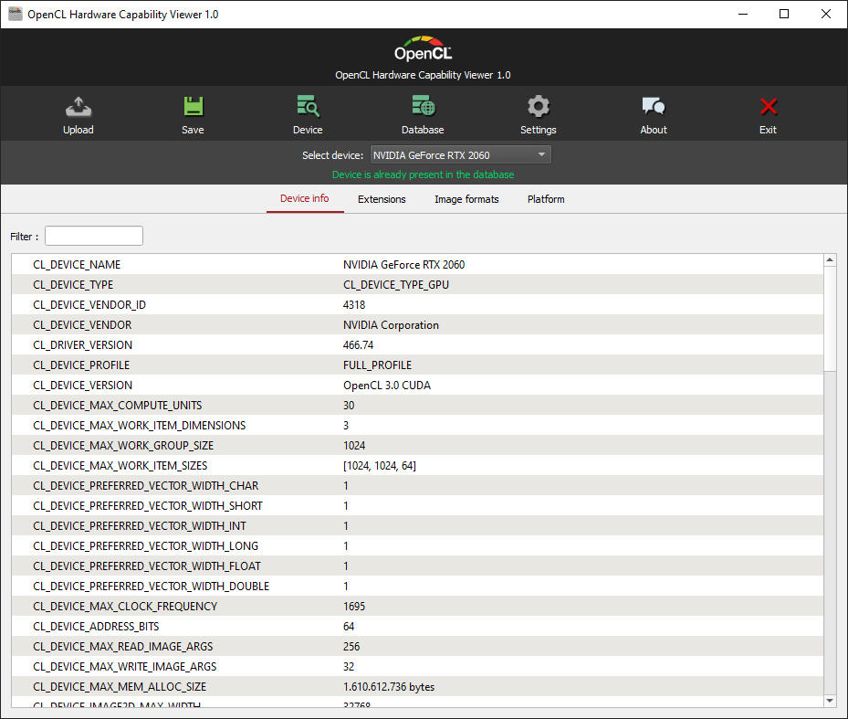

# OpenCL Hardware Capability Viewer

Client application to display hardware implementation details for devices supporting the [OpenCL](https://www.khronos.org/opencl/) API by Khronos.

The hardware reports can be submitted to a public [online database](https://opencl.gpuinfo.org/) that allows comparing different devices, browsing available features, extensions, formats, etc.

# Supported platforms
**A OpenCL compatible device (GPU, CPU) is required**
- Windows (x64)
- Linux (x64)
- Android

# Building

The repository includes a project file for the [Qt Creator IDE](https://www.qt.io/ide/) that has been tested to work with Windows, Linux and Android. This is the preferred (and easiest) way of building the application if you want to build it yourself. Using the [Qt Visual Studio Tools](https://marketplace.visualstudio.com/items?itemName=TheQtCompany.QtVisualStudioTools2019), it's also possible to use a current Visual Studio version.
Alternatively, you can simply run `qmake` followed by `make` in the source directory.

It also requires an OpenCL ICD loader for the target platform, such as the [official OpenCL ICD loader from Khronos](https://github.com/KhronosGroup/OpenCL-ICD-Loader).

# Releases
Current releases for all platforms will be provided on a regular basis at [https://opencl.gpuinfo.org/download.php](https://opencl.gpuinfo.org/download.php).

# Dependencies
- [OpenCL ICD loader](https://github.com/KhronosGroup/OpenCL-ICD-Loader)
- [Qt 5.12](https://www.qt.io/developers/) - Older versions may not work due to missing functionality

# Legal
<a href="https://www.khronos.org/opencl/">OpenCL</a> and the OpenCL logo are trademarks of Apple Inc. used by permission by <a href="https://www.khronos.org">Khronos</a>
